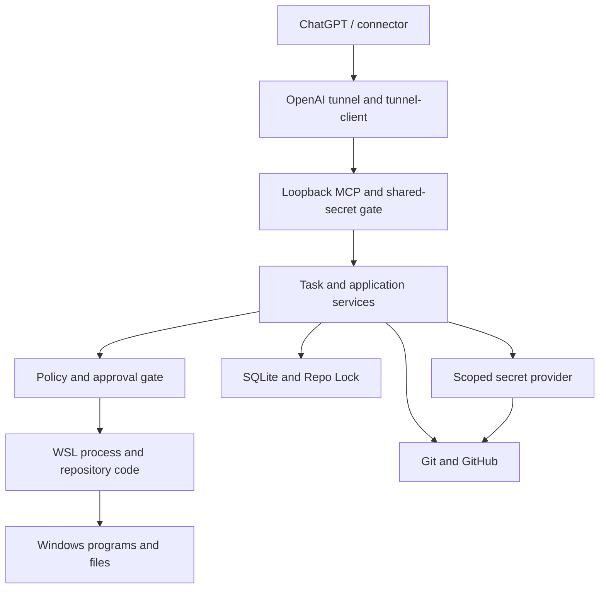

# Gram Coding Agent threat model

> **PREPARATORY DRAFT — NOT M5 ACCEPTANCE.**
> Prepared for [#114](https://github.com/jskjw157/gram-coding-agent/issues/114) and
> [#115](https://github.com/jskjw157/gram-coding-agent/issues/115).
> M4 prerequisite [#112](https://github.com/jskjw157/gram-coding-agent/issues/112)
> remains OPEN. This document does not complete M5, authorize deployment, or close
> either documentation issue. Merge requires the user's approval.

## 1. Scope and evidence baseline

- Review date: **2026-10-08, Asia/Seoul**.
- Audited M2 commit: **`d886ce3b98520e4c594e8da73b14e0bed7dbac3e`**.
- Documentation branch: `docs/m5-threat-model-prep`.
- Intended Draft PR base: `feat/m2-vertical-slice`. M2 remains an open Draft
  [PR #135](https://github.com/jskjw157/gram-coding-agent/pull/135); targeting
  `main` from this baseline would mix the M2 implementation into this diff.
- Change scope: this file and [policy-invariants.md](policy-invariants.md) only.
  All implementation statements describe the pinned M2 commit, not later branches.

The source of requirements is [AGENTS.md](../../AGENTS.md), the
[approved architecture](../superpowers/specs/2026-09-15-gram-coding-agent-design.md),
the [M5 plan](../superpowers/plans/2026-09-15-m5-hardening-production-readiness.md),
and the specifications for
[external coding](../superpowers/specs/2026-09-30-external-coding-capability-design.md),
[immutable verification/publishing](../superpowers/specs/2026-09-30-head-bound-verification-design.md),
and the [verification coordinator](../superpowers/specs/2026-09-30-verification-coordinator-design.md).
The [M3 recovery plan](../superpowers/plans/2026-09-15-m3-reliability-recovery.md)
and [M4 Windows plan](../superpowers/plans/2026-09-15-m4-windows-integration-ux.md)
describe future dependencies, not implemented controls.

### Evidence vocabulary

| Label | Meaning in these two documents |
| --- | --- |
| SOURCE | The implementation or configuration was inspected at the pinned commit. This establishes what code says, not an executed security guarantee. |
| TESTS PRESENT | Named, existing tests were inspected. They were **not rerun in this documentation task**. |
| HISTORICAL CI | GitHub reports the PR-triggered [CI run 37552771185](https://github.com/jskjw157/gram-coding-agent/actions/runs/37552771185), associated with the M2 head, completed successfully. This is historical suite evidence, not a fresh per-invariant test or live target acceptance. |
| PARTIAL / GAP | Some control exists, but the complete rule is not established or a specific unchecked path was identified. |
| CONFIG ONLY / PLANNED | A deployment contract or future requirement exists; effective deployment or production implementation has not been demonstrated. |

No security attack suite, real Windows/WSL run, credential-scope inspection,
process-crash experiment, or backup/restore was performed for this draft.
[m2-live-smoke.md](../operations/m2-live-smoke.md) is a procedure and acceptance
template; its existence is not a successful live result. A successful unit suite
does not establish all SEC rules.

Test collection also matters: [vitest.config.mts](../../vitest.config.mts)
selects package/application projects; existing `tests/ops` tests are outside
those projects. [package.json](../../package.json) has no `test:security` or
`test:concurrency` script at this baseline. The future M5 suite must explicitly
collect its tests and fail if it collects none.

### Coordination and issue snapshot

Before editing, #114/#115 and parent #113 had no CLAIM comments; all 25 returned
open PRs' changed-file lists were checked, with no overlap on these two files.
The requested branch was absent. This is a dated coordination observation, not
a permanent ownership claim.

| Issue | Observed status | Relevant integrated change |
| --- | --- | --- |
| [#112](https://github.com/jskjw157/gram-coding-agent/issues/112), [#114](https://github.com/jskjw157/gram-coding-agent/issues/114), [#115](https://github.com/jskjw157/gram-coding-agent/issues/115) | OPEN | Acceptance/dependency gates remain open. |
| [#153](https://github.com/jskjw157/gram-coding-agent/issues/153) | CLOSED | [PR #164](https://github.com/jskjw157/gram-coding-agent/pull/164): reject unsupported redirection and command substitution, including legacy backticks. |
| [#187](https://github.com/jskjw157/gram-coding-agent/issues/187) | CLOSED | [PR #190](https://github.com/jskjw157/gram-coding-agent/pull/190): reject filesystem-operand expansions, including literal-decoy tilde/glob cases. |
| [#191](https://github.com/jskjw157/gram-coding-agent/issues/191) | CLOSED | [PR #193](https://github.com/jskjw157/gram-coding-agent/pull/193): reject dynamic argument expansion before policy hashing, including non-filesystem arguments. |
| [#192](https://github.com/jskjw157/gram-coding-agent/issues/192) | CLOSED | [PR #194](https://github.com/jskjw157/gram-coding-agent/pull/194): reject unmodeled background/pipeline/newline composition. |

These issue closures concern their parser scopes. They do not prove arbitrary
shell grammar, program behavior, descendant processes, or the whole M5 model safe.

## 2. Assets, actors, and assumptions

| Asset | Required protection |
| --- | --- |
| MCP internal secret, tunnel runtime credential, GitHub credential | Confidentiality; narrow adapter use; no administrative tunnel credential in the long-running runtime. |
| Task UUID, workspace/repository binding, approvals and accepted reviews | Integrity, freshness, single use where required, and attribution to the correct task/attempt. |
| Task worktree, canonical checkout, other tasks, agent code/configuration | Normal task edits remain inside their authorized worktree; task content cannot alter its own security authority. |
| Git commits, protected refs, remote repository identity, PR/CI evidence | Publish only verified content to the intended repository/ref; never replace or delete protected history. |
| SQLite, lock files, audit trail and recovery state | Consistent ownership and truthful evidence across concurrency, interruptions and storage failures. |
| Windows files, programs, clipboard and host credentials | Typed, bounded operations; raw Windows execution requires approval; data conversion does not confer authority. |
| Process memory, log/state disk, service availability | Bound resource consumption and preserve uncertain state for recovery. |

**Attackers and failure sources.** An unauthenticated remote caller may try to
reach MCP. A compromised or prompt-influenced authenticated controller may submit
harmful tasks, misleading review results or approvals. A repository contributor
can supply instructions, source, package scripts, hooks, tool configuration and
output that influence the controller or execute during verification. A local
same-user process may race paths, read accessible credentials or alter Git/agent
state. Incorrect configuration, stale provider responses, process death, WSL
termination, disk exhaustion and SQLite/WAL corruption need no malicious actor.

**Trust assumptions that limit the claim.**

1. The OpenAI control plane, correctly configured connector, official local
   tunnel client, agent installation, OS/kernel and operator provisioning are
   trusted components. Their compromise is not repaired by the TypeScript policy
   parser. Configuration mistakes and credential misuse remain in scope.
2. There is **one authenticated control-plane trust domain**, as explicitly
   specified for external coding. Task/step IDs correlate requests; they are not
   tenant credentials. Local MCP authentication does not independently prove
   human consent. Approval tools use that same authenticated domain.
3. Repository text, source, comments, test output and CI logs are data, not
   authority to change policy, disclose credentials or approve operations.
   An external review PASS is a controller attestation whose identity/content
   bindings can be checked; it is not proof of independent reviewer judgment.
4. The original design allows ordinary development tools and full WSL operating
   authority. The current process runner supplies no OS sandbox. Therefore an
   in-scope malicious build script can reach the same-user boundary; it cannot
   be dismissed as an already-compromised administrator.
5. API path checks, an environment allowlist, credential file mode `0600`, and
   Repo Lock coordination each address different risks. None provides complete
   filesystem, network or credential isolation from arbitrary same-user code.

This draft records the tension between trusted development execution and hostile
repository execution. It does not resolve that architecture decision by silently
granting scripts more authority or claiming isolation that does not exist.

## 3. Trust boundaries and current controls

The following is a trust/data-flow sketch, not a declaration that every designed
MCP tool is wired in production:

### B1. ChatGPT → OpenAI tunnel-client → loopback MCP

**Threats:** unauthorized connector access, exposure on a LAN/wildcard listener,
stolen or overprivileged runtime credentials, forged local requests, and sensitive
health/error responses.

[server.ts](../../packages/mcp/src/server.ts) accepts only literal `127.0.0.1`
or `::1`, rejects an empty internal secret, applies SDK localhost Host validation,
and checks `x-gram-agent-auth` before dispatching `/mcp`.
[auth.ts](../../packages/mcp/src/auth.ts) uses `timingSafeEqual` for equal-length
buffers; a length mismatch returns early. This is not a constant-duration claim
for every authentication failure.

The [tunnel unit](../../systemd/openai-mcp-tunnel.service) and
[example configuration](../../config/tunnel-client.example.yaml) select official
`tunnel-client`, loopback `/mcp`, a file-backed internal header, and a runtime
key documented as restricted Tunnels Read + Use. The
[agent unit](../../systemd/gram-coding-agent.service) does not load the tunnel
environment file. These are configuration contracts; actual binary identity,
connector authorization, key privileges and deployed sockets were not inspected.
Tailscale is for device administration, not an alternative MCP tunnel.

`/healthz` is intentionally outside the MCP secret gate after Host validation.
Its production callback returns health metadata, but the server serializes the
callback result without general redaction. A future health expansion must not
return tasks, credentials or arbitrary adapter objects. There is no startup
check proving an accidentally inherited admin credential absent.

Rules: [SEC-MCP-001](policy-invariants.md#sec-mcp-001),
[SEC-MCP-002](policy-invariants.md#sec-mcp-002),
[SEC-TUN-001](policy-invariants.md#sec-tun-001),
[SEC-TUN-002](policy-invariants.md#sec-tun-002).

### B2. Task Engine ↔ Policy Engine ↔ executing process

**Threats:** an instruction or wrapper lowers risk, a grant is replayed or rebound,
an inactive task executes, or repository code bypasses policy through a child.

[CommandRunner](../../packages/shell/src/command-runner.ts) normalizes before
evaluation; a DENY prevents approval consumption and spawn. NEEDS_APPROVAL must
consume a task/hash grant before command evidence and spawn. The parser rejects
the unsupported syntax covered by the four security fixes above.
[ApprovalRepository](../../packages/persistence/src/repositories/approval-repository.ts)
provides atomic task/hash consumption, expiration and single use.

The complete semantic boundary is **partial**.
[operationHash](../../packages/policy/src/policy-engine.ts) omits `cwd`,
executable identity/PATH resolution, and the full shell/wrapper execution context.
Known `env`/`sudo` unwrapping is narrower than recursive shell interpretation.
Approval of an opaque `sh -c`/`bash -c` payload does not prove its inner actions
preserve unconditional DENY rules.

[classifyRisk](../../packages/policy/src/risk-classifier.ts) allows Node, Python,
package-manager workflows and utilities with powerful options. The runner checks
the directly requested operation, not program source or descendant operations.
Generic `CommandRunner` also does not itself resolve every `taskId/cwd` against
an active workspace/lease. Production application adapters supply additional
bindings. No exposed or future interface may assume that a task ID alone supplies
all of that authorization.

Rules: [SEC-POL-002](policy-invariants.md#sec-pol-002),
[SEC-POL-003](policy-invariants.md#sec-pol-003),
[SEC-POL-004](policy-invariants.md#sec-pol-004),
[SEC-TASK-001](policy-invariants.md#sec-task-001).

### B3. Task authority ↔ worktree files and command side effects

**Threats:** traversal into the canonical checkout/another task, symlink or
hardlink escape, path replacement between check and use, stale patch content,
and option-like arguments changing a supposedly read-only command.

[WorkspacePathGuard](../../packages/filesystem/src/workspace-path-guard.ts)
checks task-relative lexical paths and canonical targets; new files use their
nearest existing ancestor. The currently exposed
[ExternalCodingCapability](../../apps/agent/src/external-coding-capability.ts)
adds RUNNING-state, repository/workspace/branch, process-owned lease, step/phase/
expiry, analysis-approved paths and old-content hash checks. It rejects sensitive
metadata/configuration paths, symlinks, hardlinks, nonregular files and oversized
source. Durable step claiming and checks before each patch limit replay and lost
lease writes; a patch batch is not a filesystem transaction.

These controls must not be generalized beyond their layer. Generic
[FileService](../../packages/filesystem/src/file-service.ts) has weaker hardlink/
metadata restrictions and uses pathname-based writes after validation. A separate
same-user process can still race ancestor replacement. The worktree-command guard
in [worktree-path.ts](../../packages/policy/src/worktree-path.ts) likewise documents
the check-to-spawn race. An allowed test/build process has no general worktree
filesystem confinement.

[startAgent](../../apps/agent/src/main.ts) currently wires health, task creation,
coding steps, verification reviews and approvals. Optional generic code/Git/read
ports exist in the MCP server but are not passed by this production composition.
For example, [CodeSearch](../../packages/filesystem/src/code-search.ts) passes a
pattern to `rg` without `-e`/`--`; leading-option behavior needs testing before
that optional interface is exposed. This is a latent adapter concern, not a
demonstrated live MCP exploit.

Rules: [SEC-FS-001](policy-invariants.md#sec-fs-001),
[SEC-TASK-001](policy-invariants.md#sec-task-001),
[SEC-POL-004](policy-invariants.md#sec-pol-004).

### B4. WSL ↔ Windows

**Threats:** data becomes executable PowerShell/CMD, a generic Windows execution
tool defeats WSL policy, conversion selects the wrong target, or clipboard data
exposes secrets.

Direct raw `powershell.exe`, `pwsh.exe`, `cmd.exe` and other `.exe` requests
are approval-classified by [risk-classifier.ts](../../packages/policy/src/risk-classifier.ts).
Existing [PathMapper](../../packages/workspace/src/path-mapper.ts) implements
Linux-to-Windows conversion through task-attributed `wslpath -w`; the
[application adapter](../../apps/agent/src/command-adapters.ts) uses direct argv.
Path conversion is not file authorization.

The M4 `packages/windows-integration` package, bidirectional WindowsPathService,
typed open/reveal/clipboard tools and Windows escape suite are **absent at this
baseline**. Clipboard text/size/redaction rules are planned. Direct raw-command
approval does not prevent an allowed interpreter or repository script from
launching a Windows descendant. No actual Windows/WSL execution was tested here.

Rules: [SEC-WIN-001](policy-invariants.md#sec-win-001),
[SEC-WIN-002](policy-invariants.md#sec-win-002),
[SEC-WIN-003](policy-invariants.md#sec-win-003).

### B5. Local Git / credentials ↔ GitHub push, PR and CI

**Threats:** protected history destruction, credential exfiltration, retargeted
`origin`, hook-modified commits, mismatched SHA/ref confirmation, stale CI, or
lock ownership extending into network observation.

[PublishingService](../../packages/publishing/src/publishing-service.ts) requires
verification, commits explicit paths, records an unconfirmed commit, pushes the
inspected immutable SHA, confirms SHA/ref, persists confirmation, then releases
the lease. [BoundPublishingVerification](../../apps/agent/src/verified-publishing.ts)
and [TaskVerificationSnapshots](../../apps/agent/src/verification-snapshot.ts)
bind publication to task, plan, HEAD, reviewed paths and exact committed bytes.
An altered commit is blocked before push. The external secret-scan/diff-review
PASS remains an authenticated controller attestation, not an autonomous
comprehensive scanner or independently authenticated reviewer.

[RemoteService](../../packages/git/src/remote-service.ts) checks both the full SHA
and `refs/heads/<branch>`. It does not attest that the current `origin` resolves
to the registry's immutable GitHub repository ID. Config/helper changes could
therefore redirect a push and still produce matching SHA evidence; this is a
source-grounded threat inference, not an exploit executed in this review.

Protected push checks cover the represented remote-ref operations and
`context.protectedBranches`, defaulting to `main/master`. Production Git
construction supplies task identity but does not discover all remote protected
branches. Local `git branch` deletion is a separate unchecked concern; do not
equate remote force/delete checks with all protected branch behavior.

[GitHubClient](../../packages/github/src/github-client.ts) leases a credential per
HTTP request and suppresses transport/HTTP-body errors. The
[production transport](../../apps/agent/src/github-services.ts) uses a fixed
GitHub API origin, refuses redirects and bounds requests. This does not establish
live token scope or Git CLI credential-helper isolation.

[TaskRunner](../../packages/task-engine/src/task-runner.ts) orders publish,
PR creation/reuse, then CI observation. GitHub services have no mutation-lock
dependency. The **observing task** must not hold a lease; another task may acquire
that repository while observation continues. CI uses persisted confirmed SHA and
required-check identity. Active rulesets and legacy statuses are conservatively
unsupported in the production wrapper, not fully implemented.

SHA/name/app matching occurs when checks are ingested. However,
[CiRunRepository](../../packages/persistence/src/repositories/ci-run-repository.ts)
stores no own commit SHA/commit ID or required-rule/app binding. Its rows alone
cannot reconstruct historical exact-SHA association after another publish by the
same task or recovery. This is a durable provenance limitation, not a demonstrated
wrong-SHA completion in the normal flow.

Rules: [SEC-POL-001](policy-invariants.md#sec-pol-001),
[SEC-GIT-001](policy-invariants.md#sec-git-001),
[SEC-GIT-002](policy-invariants.md#sec-git-002),
[SEC-GIT-003](policy-invariants.md#sec-git-003),
[SEC-LOCK-001](policy-invariants.md#sec-lock-001),
[SEC-LOCK-002](policy-invariants.md#sec-lock-002).

### B6. SQLite / Repo Lock ↔ process interruption and recovery

**Threats:** competing writers, expired leases with live children, PID/boot
ambiguity, file/database disagreement, crash after a remote effect, unsafe replay,
corrupt storage and cleanup of unpushed work.

[RepoLockService](../../packages/repo-lock/src/repo-lock-service.ts) combines an
exclusive `wx` lock file, token-bound SQLite ownership, heartbeat and recovery
marking. [LockRepository](../../packages/persistence/src/repositories/lock-repository.ts)
uses an immediate transaction.
[database.ts](../../packages/persistence/src/database.ts) configures WAL, foreign
keys and busy timeout. Graceful shutdown drains work and quiesces retained leases
without deleting unconfirmed state.

The primitive `lease.release()` does not independently check remote confirmation;
normal publishing composition owns that ordering. SQLite/file operations and
remote push are not one transaction. An audit timestamp is evidence of a local
event, not an atomic transaction spanning GitHub.

No production boot recovery coordinator, stale-lock reconciler, janitor,
integrity service or online backup/restore service exists at the baseline.
Heartbeat failure marking does not prove a running child was terminated.
Process/WSL death between remote effect, persistence and release requires future
reconciliation tests. Expired TTL alone must not authorize another writer or
deletion of uncertain work.

Rules: [SEC-LOCK-002](policy-invariants.md#sec-lock-002),
[SEC-LOCK-003](policy-invariants.md#sec-lock-003),
[SEC-LOCK-004](policy-invariants.md#sec-lock-004),
[SEC-DB-001](policy-invariants.md#sec-db-001),
[SEC-OPS-001](policy-invariants.md#sec-ops-001).

### B7. Secrets / repository-controlled output ↔ durable and public sinks

**Threats:** task input, stdout/stderr, exceptions, Git metadata, clipboard or
provider responses persist secrets; allowed scripts obtain credentials through
environment, files or helpers; excessive output exhausts memory/disk.

[SecretRedactor](../../packages/secrets/src/redactor.ts),
[StructuredLogger](../../packages/observability/src/logger.ts) and
[OutputCapture](../../packages/shell/src/output-capture.ts) redact recognized
values before their sinks. The generic child environment excludes high-value
credential variables. [FileSecretProvider](../../packages/secrets/src/file-secret-provider.ts)
offers scoped leases and checks file type/permissions. No generic MCP secret-read
tool is registered.

The global no-leak rule has **specific uncovered flows** in source:

- [TaskService.create](../../packages/task-engine/src/task-service.ts) trims
  goal/repository text; [TaskRepository](../../packages/persistence/src/repositories/task-repository.ts)
  stores it, and [task_create](../../packages/mcp/src/tools/task-tools.ts) serializes
  the returned view without secret rejection/redaction.
- [AuditRepository.append](../../packages/persistence/src/repositories/audit-repository.ts)
  serializes arbitrary payloads; [TaskScheduler.failTask](../../apps/agent/src/task-scheduler.ts)
  writes raw error messages to audit before the redacting logger.
- The shared redactor in [main.ts](../../apps/agent/src/main.ts) is initialized
  with the internal MCP secret only. Pattern matching does not guarantee
  recognition of every other credential.

Environment filtering retains HOME/PATH and shell-text runs `/bin/bash -lc`.
Same-user files, shell startup configuration and Git helpers remain ambient
access paths. Redacting a command log cannot undo an external network disclosure
or remove a secret already written to SQLite/Git.

The specialized [verification review runner](../../apps/agent/src/verification-review-command.ts)
bounds fixed Git reads and stores omission/hash/size metadata instead of source.
The generic process runner still accumulates unlimited output, with no execution
deadline or child-tree control. Broad output bounds, rotation, integrity checking
and safe diagnostics remain future work.

Rules: [SEC-SEC-001](policy-invariants.md#sec-sec-001),
[SEC-SEC-002](policy-invariants.md#sec-sec-002),
[SEC-SEC-003](policy-invariants.md#sec-sec-003),
[SEC-OPS-001](policy-invariants.md#sec-ops-001).

## 4. Residual risk register

Priorities below are preparatory engineering judgments based on the inspected
sources, not measured exploit likelihood or a new issue-closure decision.
“Unverified” must not be read as “safe”.

| Risk | Priority | Evidence and consequence | Required disposition / rules |
| --- | --- | --- | --- |
| TM-01 Malicious allowed program or descendant | High | SOURCE gap: direct-spawn policy is not process isolation. Repository tests/hooks may access host, Windows, other worktrees, credentials or agent state. | Decide and enforce the repository-execution trust boundary; adversarial fixtures with outside-file/credential/Windows-child canaries. SEC-POL-004, SEC-FS-001, SEC-WIN-001, SEC-SEC-003. |
| TM-02 Incomplete approval meaning | High | SOURCE gap: hash omits cwd and other effective context; opaque shell wrappers do not preserve inner DENY classification. | Bind complete execution meaning; test changed cwd/PATH/wrappers and unconditional DENY. SEC-POL-002, SEC-POL-003. |
| TM-03 Credential-bearing task/audit/response data | High | SOURCE gap: task_create and raw audit/error persistence lack a universal secret boundary. No exploit run is claimed. | Synthetic-secret ingress-to-sink sweep, then reject/omit/redact before storage/response. SEC-SEC-002. |
| TM-04 Same-user path races | High | SOURCE limit: pathname checks do not isolate concurrent processes; generic file APIs are weaker than exposed coding capabilities. | Race symlinks/hardlinks/ancestors and verify external canaries unchanged. SEC-FS-001, SEC-TASK-001. |
| TM-05 Retargeted Git origin / incomplete protected list | High | SOURCE gap and threat inference: exact SHA/ref alone does not bind remote repository identity; production defaults do not enumerate remote protections. | Verify intended remote identity and protected destinations, including non-main branches and local deletion. SEC-GIT-001, SEC-POL-001, SEC-LOCK-002. |
| TM-06 Crash or lease loss with ongoing mutation | High | PARTIAL: heartbeat/graceful shutdown exist; no production reconciliation or child fencing proves safe restart. | Process-kill/reboot/lease-loss matrix; preserve ambiguous work; do not reclaim on TTL alone. SEC-LOCK-003, SEC-LOCK-004. |
| TM-07 Privileged runtime key or incorrect tunnel deployment | High | CONFIG ONLY: official/restricted templates exist; live binary, sockets, connector access and effective credential scope unverified. | Target evidence with boolean/scope metadata only; no admin key in parent runtime. SEC-MCP-001, SEC-MCP-002, SEC-TUN-001, SEC-TUN-002. |
| TM-08 Corrupt SQLite/WAL, unsafe restore or cleanup | High | PLANNED: healthy-open state and migration tests do not prove integrity/recoverability. | Corrupt copied fixtures, online backup/restore and dirty/unpushed/recovery retention tests. SEC-DB-001, SEC-LOCK-004. |
| TM-09 Unbounded output or hung process | High | SOURCE gap: generic output and process lifetime are unbounded; specialized review bounds do not cover all commands. | Bound streams, logs, process tree and shutdown; test full disk and recovery evidence. SEC-OPS-001. |
| TM-10 Controller compromise or misleading review | High | Explicit trust assumption: one controller domain can submit reviews and approvals; local code cannot establish independent human judgment. | Document this trust dependency; preserve exact task/review binding and assess separately before expanding callers. SEC-MCP-002, SEC-POL-003, SEC-GIT-002. |
| TM-11 Incomplete test collection / false assurance | High | SOURCE: no security/concurrency script and ops tests outside root projects. Historical CI cannot prove all rules. | Explicit suite collection and nonzero required-test counts; evidence per SEC ID before #130. All SEC IDs. |
| TM-12 Optional read-adapter argument semantics | Medium | SOURCE concern: option-like rg patterns are not covered; optional codeTools are not wired in startAgent. | Test fixed argument meaning before exposure, including tool subprocess options. SEC-POL-004, SEC-FS-001. |
| TM-13 Historical CI association after republish/restart | Medium | SOURCE gap: ingestion checks SHA/app/name, but CI rows do not independently retain SHA/commit or required-rule/app binding. | Test multiple publishes and recovery; retain durable association without rebinding old checks to a new commit. SEC-GIT-003. |

## 5. Evidence needed after prerequisite acceptance

The companion [invariant register](policy-invariants.md) owns canonical SEC IDs,
source/test references, present status and the future automation backlog. Every
rule has a concrete falsification method; no entry is promoted to global PASS
by this draft.

After #112 is accepted, review this register against the actual M3/M4 integration
SHA. Preserve existing parser regressions and add tests at the production
application/MCP boundary for the gaps above. Use disposable repositories, local
bare remotes, synthetic credentials and external canaries; do not run destructive
examples on a real worktree or inspect real secret values to prove redaction.

Acceptance needs separate evidence for software behavior, test collection,
actual target Windows/WSL/tunnel configuration, deployed credential scope,
process-crash recovery and consistent backup/restore. PR/CI observations must
remain lock-free while that evidence is gathered. A future release record must
identify tested commit, environment, scenario, expected/observed result and
artifact for each SEC ID, and retain unresolved High/Critical risks as blockers
under [#130](https://github.com/jskjw157/gram-coding-agent/issues/130).

This preparatory change does not update implementation plans, runtime policies,
tests, CI, settings, issue states, release tags or acceptance records.
